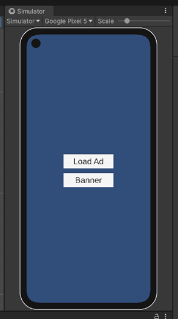

# Unity Mobile App

### Overview

- Design a user interface (UI) with at least two screens/pages
- Implement user authentication using a remote firebase.
- Integrate an advertisement framework for displaying banner ads within the app.
- Ensure secure data transmission between the app and the remote server

Candidates should submit the Unity project, highlighting their skills in UI design, user authentication, ad integration, Airtable usage and secure data handling. Include documentation explaining the implementation details and any challenges faced during the development process.

### Project Structure

The project was developed with the default Unity project structure, where scene files and scripts are placed in their respective folders

### Scenes

This holds all the scene files for the project, in this case the Ads scene and the Auth Scene.
The Auth scene is where the user gets to login or create an account to access the app

The Ads scene loads up after the user successfully signs in. There are two buttons; one to load a full screen ad and one to load a banner ad

### Challenges Faced

In an attempt to integrate Airtable into the project, I noticed there’s no documentation on how to integrate it in Unity. After some online searches, a package was found on GitHub that had some examples on how to access an Airtable record, however, it seemed outdated as Airtable now only uses tokens now instead of App IDs and App Keys. Due to the lack of documentation on integrating Airtable in Unity, I ended up leaving out its implementation as I couldn’t figure out how to set it up.

### Conclusion

The aim of the project was to build an app in Unity with authentication, ads integration and an Airtable implementation to serve as a database of sorts.

I was able to set up the firebase authentication to handle the user registration and login processes. I was also able to set up the Ads integration using Unity Ads.

Overall, regardless of not being able to handle the Airtable integration, I am proud of being able to complete the other subtasks of this project as it’s been a while since I developed anything with Unity
